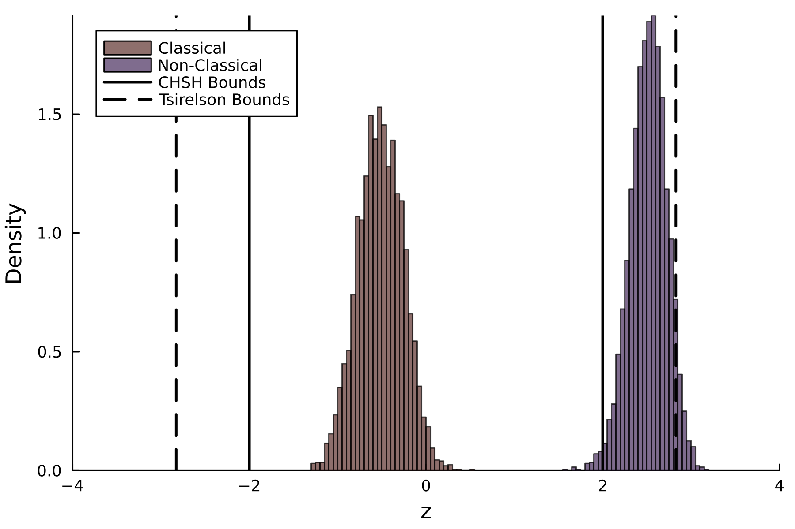

# CHSH Inequality 

We define four attributes indexed as $j \in \{1,2,3,4\}$. The attributes could correspond to binary traits of a person, such as extroverted, intelligent, unusual and agreeable, respectively. The joint distribution of 4 binary traits has $2^4 = 16$ elements. The measurement context $c_{ij}$ corresponds to measurements (i.e., questions) about a person having traits $i$ and $j$. For measurement context $c_{12}$, one of the following answers is selected:

1. intelligent and extroverted
2. not intelligent and extroverted
3. intelligent and not extroverted
4. not intelligent and not extrovted

More generally, for a pair of two traits out of four triats in which order does not matter, there are a total of six measurement contexts $\{c_{12},c_{13},c_{14},c_{23},c_{24},c_{34}\}$. In this example, we will use a subset of four measurement contexts $\{c_{12},c_{23},c_{34},c_{14}\}$.

The random variable $X_i \in \{-1,1\}$ represents the answer to the question about attribute $i$, such that a *yes* response maps to $-1$ and a *no* response maps to $1$. The following is used to test whether there is a measurement context effect leading to so-called *super correlations* between attributes $i$ and $j$ in different contexts $c_{ij}$:

```math 
z = \mathop{\mathbb{E}}(X_1X_2) + \mathop{\mathbb{E}}(X_3X_2) + \mathop{\mathbb{E}}(X_3X_4) - \mathop{\mathbb{E}}(X_1X_4). 
```
The expected value for the product of the response varible $X_i$ and $X_j$ is defined as

```math
E[X_iX_j] = \sum_{x_i,x_j \in \{-1,1\}} = x_i x_j p_{ij}(X_i = x_i, X_j = x_j)
```


```math
|z| \leq 2
```


# Application


```@raw html
<details>
<summary><b>Show Full Code</b></summary>
```
```julia
using Distributions
using MCMCChains
using Mooncake
using Random
using StatsPlots
using Turing
using TuringUtilities

Random.seed!(7847)

@model function model(; y12, y32, y34, y14, n_obs)
    # prior distribution over response probability parameters
    θ12 ~ Dirichlet(fill(1, 4))
    θ32 ~ Dirichlet(fill(1, 4))
    θ34 ~ Dirichlet(fill(1, 4))
    θ14 ~ Dirichlet(fill(1, 4))

    # data distribution 
    y12 ~ Multinomial(n_obs, θ12)
    y32 ~ Multinomial(n_obs, θ32)
    y34 ~ Multinomial(n_obs, θ34)
    y14 ~ Multinomial(n_obs, θ14)
    # record posterior samples 
    return (; θ12, θ32, θ34, θ14)
end

function compute_CHSH(; θ12, θ32, θ34, θ14)
    x12 = θ12[1] + θ12[4] - θ12[2] - θ12[3]
    x32 = θ32[1] + θ32[4] - θ32[2] - θ32[3]
    x34 = θ34[1] + θ34[4] - θ34[2] - θ34[3]
    x14 = θ14[1] + θ14[4] - θ14[2] - θ14[3]
    return x12 + x32 + x34 - x14
end

n_obs = 50
θ = rand(Dirichlet(fill(1, 16)))
θ′ = reshape(θ, 2, 2, 2, 2)
Σ(θ, dims) = sum(θ; dims)[:]
data1 = (;
    y12 = rand(Multinomial(n_obs, Σ(θ′, (1, 2)))),
    y32 = rand(Multinomial(n_obs, Σ(θ′, (3, 2)))),
    y34 = rand(Multinomial(n_obs, Σ(θ′, (3, 4)))),
    y14 = rand(Multinomial(n_obs, Σ(θ′, (1, 4)))),
    n_obs
)

chains1 = sample(
    model(; data1...),
    NUTS(1000, 0.65; adtype = AutoMooncake()),
    MCMCThreads(),
    1000,
    4
)
describe(chains1)

pred_model1 = predict_distribution(;
    simulator = Θ -> compute_CHSH(; Θ...),
    model = model(; data1...),
    func = identity
)

post_preds1 = returned(pred_model1, chains1)

θ = [
    rand(Dirichlet([10, 1, 1, 1])),
    rand(Dirichlet([10, 1, 1, 1])),
    rand(Dirichlet([10, 1, 1, 1])),
    rand(Dirichlet([1, 10, 10, 1]))
]

data2 = (;
    y12 = rand(Multinomial(n_obs, θ[1])),
    y32 = rand(Multinomial(n_obs, θ[2])),
    y34 = rand(Multinomial(n_obs, θ[3])),
    y14 = rand(Multinomial(n_obs, θ[4])),
    n_obs
)

chains2 = sample(
    model(; data2...),
    NUTS(1000, 0.65; adtype = AutoMooncake()),
    MCMCThreads(),
    1000,
    4
)
describe(chains2)

pred_model2 = predict_distribution(;
    simulator = Θ -> compute_CHSH(; Θ...),
    model = model(; data2...),
    func = identity
)

post_preds2 = returned(pred_model2, chains2)

hpd(Chains(post_preds2[:]))

histogram(
    post_preds1[:],
    norm = true,
    xlims = (-4, 4),
    xlabel = "z",
    ylabel = "Density",
    label = "Classical",
    leg = :topleft,
    grid = false,
    color = RGB(94 / 255, 51 / 255, 46 / 255),
    alpha = 0.7,
    dpi = 300
)

histogram!(
    post_preds2[:],
    norm = true,
    label = "Non-Classical",
    color = RGB(73 / 255, 46 / 255, 94 / 255),
    alpha = 0.7
)
vline!([-2, 2], color = :black, linewidth = 2, label = "CHSH Bounds")

vline!(
    [-2 * √(2), 2 * √(2)],
    linestyle = :dash,
    color = :black,
    linewidth = 2,
    label = "Tsirelson Bounds"
)
```
```@raw html
</details>
```

## Load Packages

```julia 
using Distributions
using MCMCChains
using Mooncake
using Random
using StatsPlots
using Turing
using TuringUtilities
```

## Set RNG
```julia 
Random.seed!(7847)
```

## Classical Model 


### Generate Data
```julia
n_obs = 50
θ = rand(Dirichlet(fill(1, 16)))
θ′ = reshape(θ, 2, 2, 2, 2)
Σ(θ, dims) = sum(θ; dims)[:]
data1 = (;
    y12 = rand(Multinomial(n_obs, Σ(θ′, (1, 2)))),
    y32 = rand(Multinomial(n_obs, Σ(θ′, (3, 2)))),
    y34 = rand(Multinomial(n_obs, Σ(θ′, (3, 4)))),
    y14 = rand(Multinomial(n_obs, Σ(θ′, (1, 4)))),
    n_obs
)
```

```julia
(y12 = [17, 17, 5, 11], y32 = [5, 28, 6, 11], y34 = [1, 25, 14, 10], y14 = [9, 7, 24, 10], n_obs = 50)
```

### Estimate Parameters

```julia
chains1 = sample(
    model(; data1...),
    NUTS(1000, 0.65; adtype = AutoMooncake()),
    MCMCThreads(),
    1000,
    4
)
```

```julia 
Chains MCMC chain (1000×30×4 Array{Float64, 3}):

Iterations        = 1001:1:2000
Number of chains  = 4
Samples per chain = 1000
Wall duration     = 2.69 seconds
Compute duration  = 10.3 seconds
parameters        = θ12[1], θ12[2], θ12[3], θ12[4], θ32[1], θ32[2], θ32[3], θ32[4], θ34[1], θ34[2], θ34[3], θ34[4], θ14[1], θ14[2], θ14[3], θ14[4]
internals         = n_steps, is_accept, acceptance_rate, log_density, hamiltonian_energy, hamiltonian_energy_error, max_hamiltonian_energy_error, tree_depth, numerical_error, step_size, nom_step_size, logprior, loglikelihood, logjoint

Summary Statistics

  parameters      mean       std      mcse    ess_bulk    ess_tail      rhat   ess_per_sec 
      Symbol   Float64   Float64   Float64     Float64     Float64   Float64       Float64 

      θ12[1]    0.3333    0.0644    0.0009   5207.7955   2815.2954    1.0020      505.7094
      θ12[2]    0.3325    0.0648    0.0009   4717.3857   3063.6062    1.0018      458.0876
      θ12[3]    0.1109    0.0416    0.0006   4922.6523   3140.0410    1.0004      478.0202
      θ12[4]    0.2233    0.0577    0.0009   4541.1983   2805.4637    1.0002      440.9787
      θ32[1]    0.1112    0.0414    0.0006   5172.0708   2804.0740    1.0015      502.2403
      θ32[2]    0.5365    0.0672    0.0010   4640.6205   3180.9100    1.0003      450.6332
      θ32[3]    0.1295    0.0448    0.0006   4896.4417   2744.6858    1.0006      475.4750
      θ32[4]    0.2228    0.0558    0.0008   4607.0453   2956.2163    1.0016      447.3728
      θ34[1]    0.0368    0.0251    0.0004   4571.1248   2583.3431    1.0025      443.8847
      θ34[2]    0.4809    0.0675    0.0010   4535.0882   2802.2108    1.0023      440.3853
      θ34[3]    0.2781    0.0598    0.0009   4822.2814   3113.6148    0.9998      468.2736
      θ34[4]    0.2041    0.0552    0.0008   4715.8243   2892.8151    1.0020      457.9359
      θ14[1]    0.1856    0.0533    0.0007   5420.5961   3008.7271    1.0011      526.3737
      θ14[2]    0.1476    0.0478    0.0007   5079.2450   2232.7979    1.0020      493.2264
      θ14[3]    0.4640    0.0674    0.0010   4680.4942   3053.3150    1.0035      454.5052
      θ14[4]    0.2028    0.0554    0.0008   4479.8131   2786.1299    0.9997      435.0178


Quantiles

  parameters      2.5%     25.0%     50.0%     75.0%     97.5% 
      Symbol   Float64   Float64   Float64   Float64   Float64 

      θ12[1]    0.2143    0.2867    0.3316    0.3777    0.4631
      θ12[2]    0.2129    0.2872    0.3304    0.3745    0.4650
      θ12[3]    0.0454    0.0801    0.1055    0.1363    0.2060
      θ12[4]    0.1204    0.1820    0.2201    0.2610    0.3418
      θ32[1]    0.0440    0.0808    0.1071    0.1360    0.2031
      θ32[2]    0.4033    0.4912    0.5377    0.5827    0.6660
      θ32[3]    0.0571    0.0970    0.1244    0.1569    0.2299
      θ32[4]    0.1253    0.1824    0.2197    0.2595    0.3400
      θ34[1]    0.0049    0.0182    0.0316    0.0491    0.0981
      θ34[2]    0.3508    0.4359    0.4806    0.5273    0.6158
      θ34[3]    0.1672    0.2368    0.2747    0.3172    0.4042
      θ34[4]    0.1069    0.1652    0.2006    0.2387    0.3209
      θ14[1]    0.0942    0.1463    0.1830    0.2187    0.3000
      θ14[2]    0.0660    0.1134    0.1437    0.1770    0.2503
      θ14[3]    0.3326    0.4183    0.4619    0.5069    0.6005
      θ14[4]    0.1056    0.1637    0.1989    0.2372    0.3230
```

### Test CHSH Inequality

```julia
pred_model1 = predict_distribution(;
    simulator = Θ -> compute_CHSH(; Θ...),
    model = model(; data1...),
    func = identity
)

post_preds1 = returned(pred_model1, chains1)
```
```julia
hpd(Chains(post_preds1[:]))
```

```julia
HPD

  parameters     lower     upper 
      Symbol   Float64   Float64 

     param_1   -1.0210   -0.0254
```

## Non-Classical Model 

### Generate Data

```julia 

θ = [
    rand(Dirichlet([10, 1, 1, 1])),
    rand(Dirichlet([10, 1, 1, 1])),
    rand(Dirichlet([10, 1, 1, 1])),
    rand(Dirichlet([1, 10, 10, 1]))
]

data2 = (;
    y12 = rand(Multinomial(n_obs, θ[1])),
    y32 = rand(Multinomial(n_obs, θ[2])),
    y34 = rand(Multinomial(n_obs, θ[3])),
    y14 = rand(Multinomial(n_obs, θ[4])),
    n_obs
)
```

### Estimate Parameters

```julia 
chains2 = sample(
    model(; data2...),
    NUTS(1000, 0.65; adtype = AutoMooncake()),
    MCMCThreads(),
    1000,
    4
)
```

```julia 
Iterations        = 1001:1:2000
Number of chains  = 4
Samples per chain = 1000
Wall duration     = 1.63 seconds
Compute duration  = 6.53 seconds
parameters        = θ12[1], θ12[2], θ12[3], θ12[4], θ32[1], θ32[2], θ32[3], θ32[4], θ34[1], θ34[2], θ34[3], θ34[4], θ14[1], θ14[2], θ14[3], θ14[4]
internals         = n_steps, is_accept, acceptance_rate, log_density, hamiltonian_energy, hamiltonian_energy_error, max_hamiltonian_energy_error, tree_depth, numerical_error, step_size, nom_step_size, logprior, loglikelihood, logjoint

Summary Statistics

  parameters      mean       std      mcse    ess_bulk    ess_tail      rhat   ess_per_sec 
      Symbol   Float64   Float64   Float64     Float64     Float64   Float64       Float64 

      θ12[1]    0.7038    0.0610    0.0007   8736.1575   3282.7317    0.9997     1338.0545
      θ12[2]    0.0927    0.0395    0.0005   6765.8622   2851.8666    1.0042     1036.2785
      θ12[3]    0.1480    0.0477    0.0005   8074.6243   3400.2104    1.0000     1236.7322
      θ12[4]    0.0556    0.0317    0.0004   7827.9388   3134.6143    1.0011     1198.9491
      θ32[1]    0.8328    0.0506    0.0006   7416.7087   3169.0650    1.0001     1135.9640
      θ32[2]    0.1298    0.0456    0.0006   6624.0316   3363.1827    1.0003     1014.5553
      θ32[3]    0.0188    0.0190    0.0003   5107.7826   2682.1159    1.0016      782.3223
      θ32[4]    0.0185    0.0188    0.0003   4862.0077   2882.1623    1.0009      744.6788
      θ34[1]    0.6847    0.0619    0.0007   7643.7667   3288.3038    1.0024     1170.7408
      θ34[2]    0.0933    0.0395    0.0005   7187.0638   3040.4832    1.0025     1100.7909
      θ34[3]    0.1291    0.0456    0.0005   7184.7069   2947.1002    0.9998     1100.4299
      θ34[4]    0.0929    0.0403    0.0005   6731.7810   2749.3852    0.9997     1031.0585
      θ14[1]    0.0374    0.0266    0.0004   5490.8816   2851.5720    1.0000      840.9989
      θ14[2]    0.8141    0.0517    0.0006   6636.3975   3504.0318    1.0001     1016.4493
      θ14[3]    0.1296    0.0444    0.0005   7053.2027   3029.9639    1.0020     1080.2884
      θ14[4]    0.0189    0.0184    0.0002   5268.5093   2549.5317    1.0018      806.9397


Quantiles

  parameters      2.5%     25.0%     50.0%     75.0%     97.5% 
      Symbol   Float64   Float64   Float64   Float64   Float64 

      θ12[1]    0.5761    0.6639    0.7061    0.7463    0.8168
      θ12[2]    0.0306    0.0641    0.0876    0.1156    0.1834
      θ12[3]    0.0658    0.1147    0.1440    0.1778    0.2517
      θ12[4]    0.0111    0.0323    0.0499    0.0727    0.1315
      θ32[1]    0.7213    0.8012    0.8371    0.8693    0.9189
      θ32[2]    0.0540    0.0964    0.1252    0.1581    0.2325
      θ32[3]    0.0005    0.0052    0.0128    0.0262    0.0707
      θ32[4]    0.0005    0.0052    0.0128    0.0251    0.0702
      θ34[1]    0.5546    0.6453    0.6874    0.7263    0.8001
      θ34[2]    0.0325    0.0650    0.0873    0.1168    0.1834
      θ34[3]    0.0534    0.0962    0.1249    0.1564    0.2310
      θ34[4]    0.0307    0.0634    0.0878    0.1162    0.1846
      θ14[1]    0.0048    0.0178    0.0312    0.0506    0.1049
      θ14[2]    0.7036    0.7801    0.8189    0.8516    0.9044
      θ14[3]    0.0555    0.0975    0.1256    0.1569    0.2271
      θ14[4]    0.0005    0.0054    0.0131    0.0268    0.0679
```

### Test CHSH Inequality

```julia 
pred_model2 = predict_distribution(;
    simulator = Θ -> compute_CHSH(; Θ...),
    model = model(; data2...),
    func = identity
)

post_preds2 = returned(pred_model2, chains2)
```

```julia
hpd(Chains(post_preds2[:]))
```

```julia
HPD

  parameters     lower     upper 
      Symbol   Float64   Float64 

     param_1    2.1084    2.9174
```


# Plot Posterior Distributions

```julia
histogram(
    post_preds1[:],
    norm = true,
    xlims = (-4, 4),
    xlabel = "z",
    ylabel = "Density",
    label = "Classical",
    leg = :topleft,
    grid = false,
    color = RGB(94 / 255, 51 / 255, 46 / 255),
    alpha = 0.7,
    dpi = 300
)

histogram!(
    post_preds2[:],
    norm = true,
    label = "Non-Classical",
    color = RGB(73 / 255, 46 / 255, 94 / 255),
    alpha = 0.7
)
vline!([-2, 2], color = :black, linewidth = 2, label = "CHSH Bounds")

vline!(
    [-2 * √(2), 2 * √(2)],
    linestyle = :dash,
    color = :black,
    linewidth = 2,
    label = "Tsirelson Bounds"
)
```

